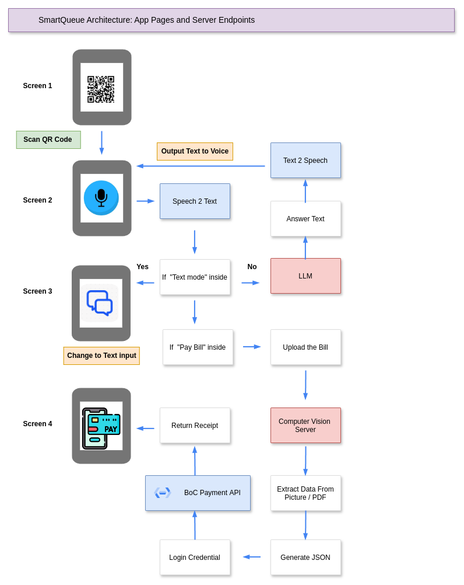

# bochackathon 5.0 - Team "SmartQueue"
> SmartQueue is a chatbot that clients can use to address their queries while waiting in a queue inside a bank.

## Team Members
- [Sergei Giniatulin](https://github.com/cyrusmsk)
- [Jianlin Ye](https://github.com/JYe9)

## Main Idea of "SmartQueue"
SmartQueue is an intelligent chatbot system designed to streamline client interactions by efficiently handling both simple and complex tasks. It utilizes computer vision for document processing and integrates with web-based services to enhance customer experience.

**Example 1: Paying a Bill (Simple Inquiry)**

When the client's request is straightforward, such as "Paying a bill", SmartQueue will guide the client through the process:

- Client Instruction: The chatbot prompts the client to either upload an electronic bill (PDF format) or take a picture of a physical bill.

- Data Extraction: Using our computer vision server, SmartQueue extracts essential payment details (e.g., invoice number, amount, due date) from the uploaded document.
Payment Page Integration:

- SmartQueue redirects the client to the corresponding payment page and auto-fills the extracted payment information.

- Client Confirmation: The client reviews the pre-filled information, confirms its accuracy, and clicks the "Submit" button to complete the payment.

This process eliminates manual data entry, speeding up the transaction and reducing potential errors.

**Example 2: Opening a Bank Account (Complex Inquiry)**
For more complex requests that cannot be handled entirely through the web interface, such as "Opening a bank account", SmartQueue takes a proactive approach:

- Initial Check: SmartQueue asks the client if they have all the necessary documents (e.g., identification, proof of address, etc.) to open a bank account.

- Document Checklist: The chatbot provides a checklist of required documents and helps the client ensure they are ready.

- Pre-Appointment Coordination:If all documents are in order, SmartQueue submits the client's inquiry and document details to the bank in advance. This helps the bank officer prepare for the appointment.

- Efficient Service: When the client's turn arrives, the bank officer can quickly review the pre-submitted information, ensuring a smoother and faster account-opening process.

This method improves the client’s in-branch experience by minimizing delays and maximizing efficiency during face-to-face interactions.

## Workflow Of "SmartQueue" Project

## Tech Stacks for "SmartQueue"
- Backend: D
- Frontend: HTML, CSS, JavaScript
- LLM Model: Llama 3.2 8B
- Computer Vision Models: OCR
- Payment Gateway: BoC API

## Advantages of "SmartQueue"
- Scalability: Can easily create new functionalities based on the existing code.
- Reliability: RAG model is used to answer the questions, so the answers are reliable and the bank can control the quality of answers.
- Security: Open-Source LLM models are running on the bank's own servers, so the data is private and secure.
- Cost-effective: The bank doesn't need to pay for the cloud services, because all the models are running on the bank's own servers.
- Customization: The chatbot can be customized to the bank's brand and style.
